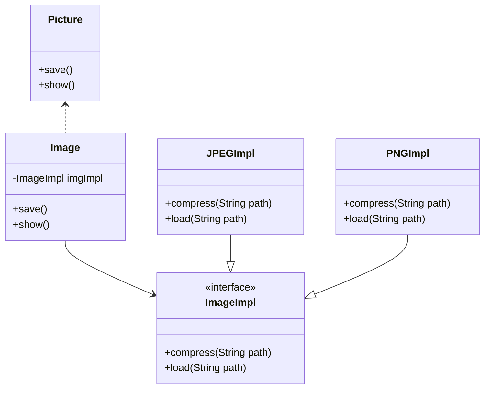
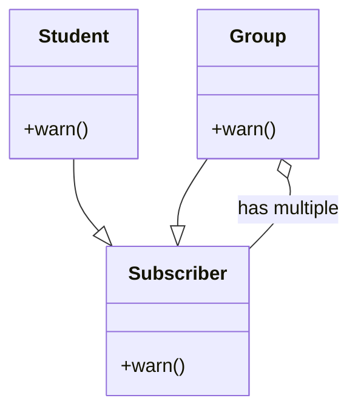
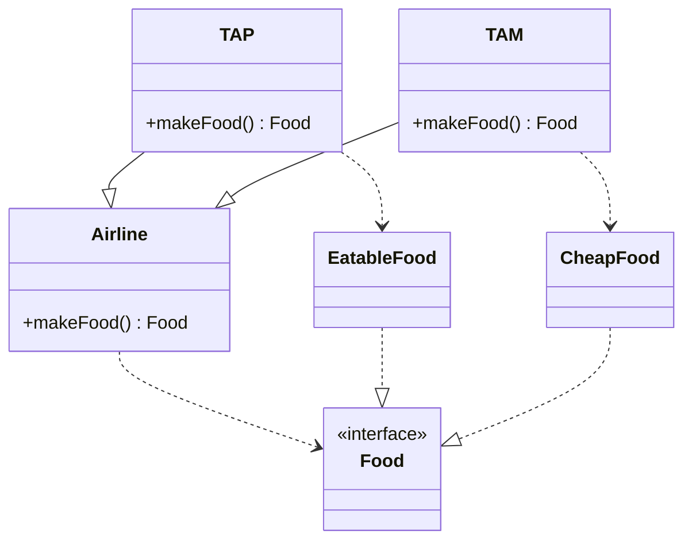
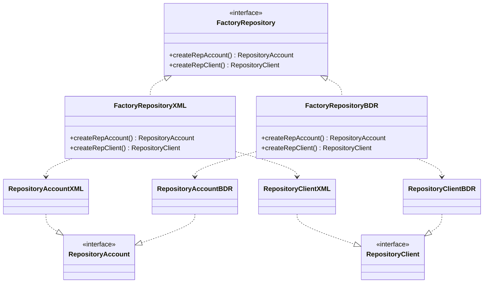

# Análise e Projeto de Sistemas

Este repositório contém artefatos complementares para os laboratórios da [disciplina Análise e Projeto de Sistemas do CIn-UFPE](www.cin.ufpe.br/~if718)

## Padrões de Projeto GoF

Para todo padrão visto na disciplina foi descrito abaixo um problema, uma possível solução (usando o padrão de projeto em questão) ilustrada em diagrama e um exemplo em código que pode ser acessado em <code>patterns/src/main/java/</code>.


### Adapter

> Como adaptar a interface da API externa do Facebook ```com.facebook.api.FacebookService``` (fictícia) para permitir a comunicação com a interface esperada pela sua aplicação?

 ```mermaid
 classDiagram
    class ISocialNetwork {
        <<interface>>
        +post()
    }
    class FacebookAdapter {
        -FacebookService fb
        +post(): void        
    }
    class FacebookService {
        +postOnTimeline()
    }
    link ISocialNetwork "patterns/src/main/java/adapter"
    link FacebookAdapter "patterns/src/main/java/adapter"
    link FacebookService "patterns/src/main/java/adapter"
    link YourApplication "patterns/src/main/java/lib/com/facebook/api"
    
    ISocialNetwork <-- YourApplication
    FacebookAdapter ..|> ISocialNetwork
    FacebookAdapter --> "fb.postOnTimeline(new Date())" FacebookService 
 ```


### Bridge

> Como desacoplar a abstração de uma Imagem da sua implementação para que possam variar de forma independente?




### Composite

> Um sistema de gerenciamente de eventos recebe inscrições de estudantes e grupo de estudantes. Grupos de estudantes podem ser compostos por outros grupos de estudantes. (Ex: CIn contém citi, pet etc.). O sistema ainda deve estar preparado a enviar avisos aos inscritos. Como modelar as entidades para que possamos tratar grupos ou estudantes como um único objeto (uniformemente)?



### Factory Method

> Companhias aéreas têm o mesmo procedimento do vôo com exceção do tipo de comida que é preparada. Na modelagem, como permitir que cada companhia instancie o seu próprio tipo de Comida?




### Abstract Factory

> Um sistema bancário permite persistir dados tanto em banco de dados relacional quanto em XML. Existem repositórios específicos para cada tecnologia tanto para Cliente quanto para Conta. Como criar a família de repositórios de uma mesma tecnologia sem especificar as classes concretas?



